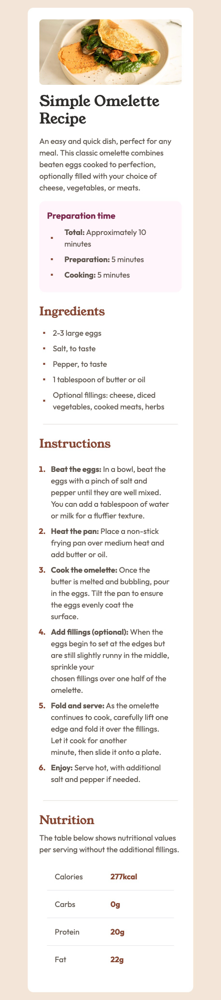
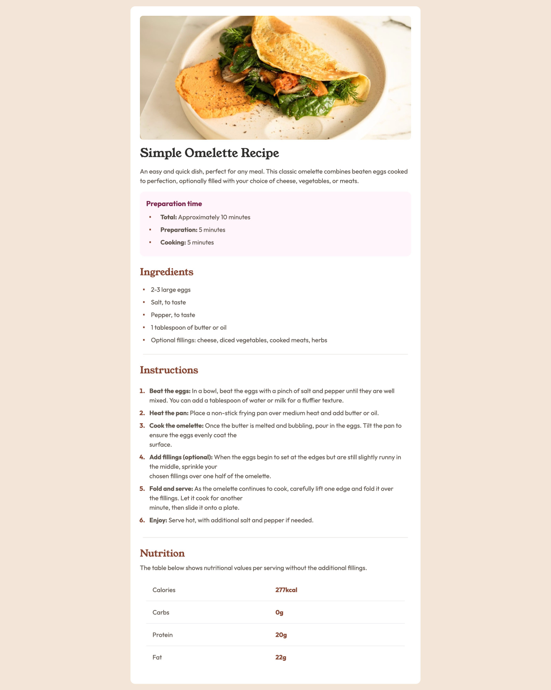

# Frontend Mentor - Recipe Page

This is a solution to the [Recipe Page](https://www.frontendmentor.io/challenges/recipe-page-KiTsR8QQKm/hub).

### Screenshots

    <h2>Mobile Screenshot</h2>
    

    <h2>Desktop Screenshot</h2>
    

### Solution Requirements

- [x] Page loads
- [x] has 2 layouts, mobile layout and desktop

### Learned

- You can style list header with marker: selector and change content with content: selector

### Links

- [Github repo]()
- [Deployed on Vercel]()

### Built with

- [Create T3 App](https://create.t3.gg/)
  - [Nextjs](https://nextjs.org/)
  - [React](https://react.dev/)
  - [TailwindCSS](https://tailwindcss.com/)
